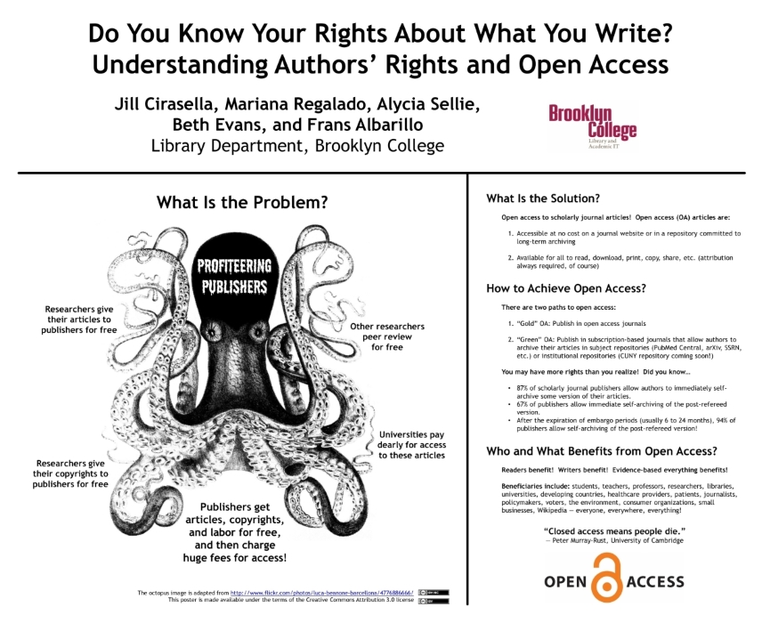
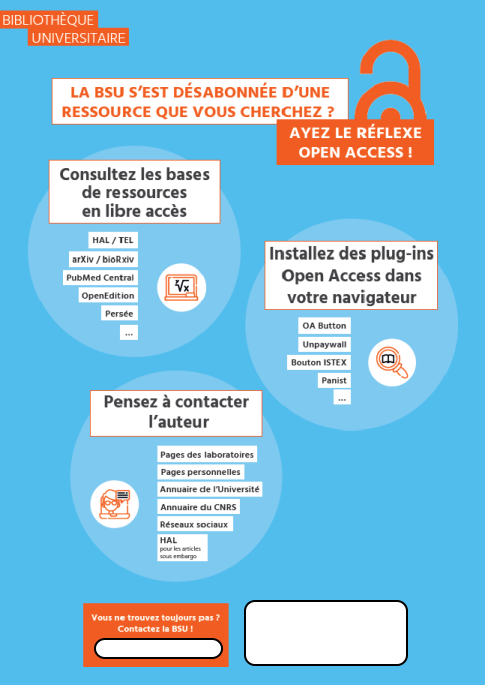
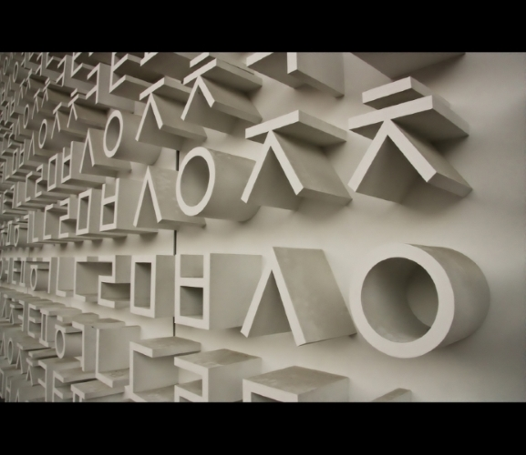
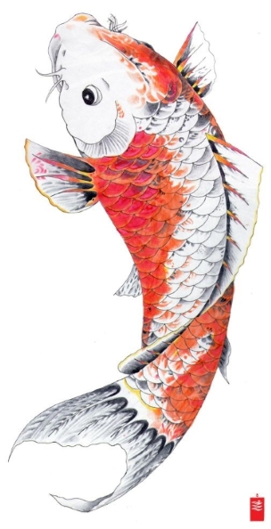
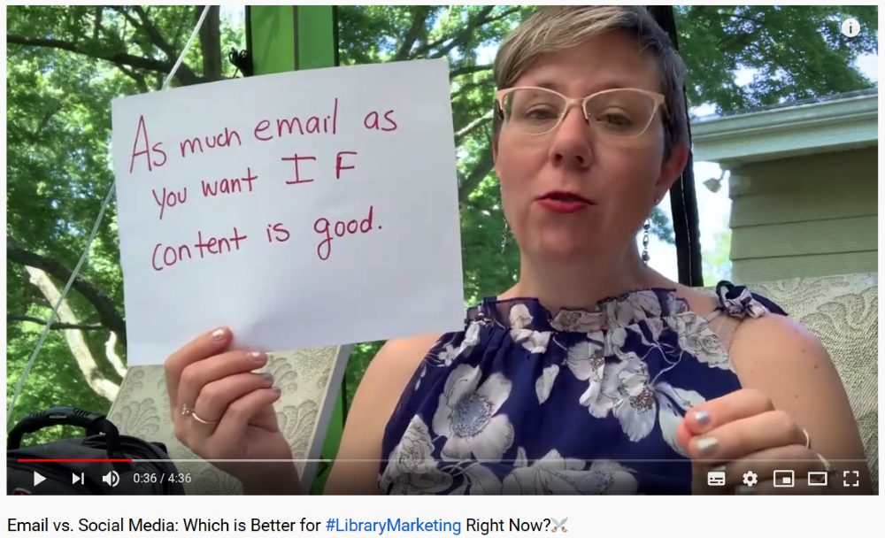

<!-- $theme: default-->
<!-- page_number: true -->
<!-- $size: 16:9 -->

# Communiquer à destination des chercheurs : médiatiser l'information scientifique et technique 
## Applications en bibliothèques

**Urfist de Bordeaux / Enssib**
16 juin 2020 
 
<small>

*Frédérique Flamerie* 
*chargée de mission science ouverte/données de recherche*
*Université de Bordeaux - Direction de la documentation*
</small>

 

---

# Mise en place

:headphones: :studio_microphone: N'oubliez pas votre casque avec micro

:mute: Coupez la vidéo et gardez votre micro en sourdine lorsque vous ne parlez pas

:raised_hand: Utilisez la fonction "Lever la main" lorsque vous souhaitez intervenir pour faciliter l'organisation de la prise de parole

:mortar_board: Nous irons régulièrement sur Moodle :point_right: vous pouvez d'ores et déjà garder un onglet ouvert sur [ce lien concernant la séquence de cet après-midi](https://moodle.enssib.fr/)
## :wrench: En cas de difficultés techniques, contactez 
:email: 
:telephone_receiver:  

---
# Programme 
## 1. Introduction
## 2. Quelles valeurs partageons-nous et comment pouvons-nous les véhiculer?

Pause brève :clapper:

## 3. Focus sur un sujet : ORCID

Pause :coffee: ou :tea: ou :tropical_drink:

## 4. Poursuite des actions imaginées à la fin de la J1

## 5. Conclusion

---

# 1. Tour de table en 3 questions

## :postal_horn: Quel est votre support ou votre mode de médiatisation préféré ?

 

Lorsqu'il s'agit de communiquer avec des chercheurs, des doctorants, des collègues de votre établissement non bibliothécaires ou documentalistes...

## :surfer:  ... avec quel sujet vous sentez-vous le plus à l'aise ? 
## :rowboat: ... avec quel sujet vous sentez-vous le moins à l'aise ?

---
# 1. A propos

## Accès à la documentation
2011-2012 : responsable bib. num. - choix, acquisition et paramétrage de SFX
2015-... : contribution à des revues et cartes systématiques en sciences de l'environnement 
## Libre accès 
2010-2017 : ouverture et administration du portail HAL-UPMC
2017-... : chargée de mission science ouverte/données de recherche à l'université de Bordeaux

## En vrac
2007-2017 : responsable des formations biblio pour les doctorants à l'UPMC
2015-... : membre de la rédaction du blog [Zotero francophone](https://zotero.hypotheses.org)

:point_right: Des moments de solitude, des essais, des erreurs :rowboat: ... et quelques satisfactions :surfer:

---

# 2. Quelles valeurs partageons-nous et comment pouvons-nous les véhiculer?

A partir de quelques exemples concrets, nous discuterons de 3 valeurs ou principes :
* applicables quel que soit le sujet traité, de l'accès à la documentation au libre accès,
* que j'ai identifiés comme des facteurs de non échec.

---

# 2.1 Que pensez-vous du poster qui apparaîtra sur l'écran suivant ?

Vous pourrez voter pour l'une des 3 options suivantes lorsque j'aurai lancé le sondage dans BigBlueButton. Vous pouvez consulter le poster en dimensions réelles sur Moodle pour mieux le lire : [lien direct poster2-1.pdf](https://moodle.enssib.fr/) :inbox_tray: 

### :white_check_mark: :recycle:  carton vert 
Ce contenu est très adapté, je peux le réutiliser immédiatement.
### :warning: :pencil2: carton jaune 
Ce contenu m'intéresse, mais il faut lui apporter des modifications mineures de fond et/ou de forme.
### :x::no_entry_sign: carton rouge
Je ne réutiliserai pas ce contenu, la forme et/ou le fond ne me paraissent pas du tout convenir.

---

---

<!-- *footer: Source : Wikimedias Commons - https://commons.wikimedia.org/wiki/File:Flag_of_Switzerland.svg -->

---
# 2.1 La neutralité 1/2

J'ai trouvé ce poster en lisant l'article dans lequel son auteur décrit l'évolution de sa stratégie de communication, et le recours à Open Access Hulk, [@openaccesshulk sur Twitter](https://twitter.com/OpenAccessHulk), pour l'aider à identifier sur quels aspects du libre accès insister auprès de quels publics. 

> Among my OA compatriots, my vitriol was a hit. But for the unfamiliar and unconverted, it was too strong, a turn-off. “I can see you have an opinion,” one faculty member said as he backed away from a poster featuring a large octopus labeled “Profiteering Publishers.” At another event, an officer of a grant-funding agency interrupted me to snap, “You’re espousing Venezuelan economics!” Again, I had gotten it wrong: what had galvanized me had alienated my audiences. 

Cirasella, J. (2017). Open access outreach : SMASH vs. Suasion. _College & Research Libraries News_, _78_(6), 323. https://doi.org/10.5860/crln.78.6.323

---

# 2.1 La neutralité 2/2

Le message des bibliothécaires de l'université de Rutgers (Royaume-Uni) se décompose en 18 points, est adapté à une durée de présentation de 12 à 15 minutes et propice à des spécifications en fonction de l'auditoire. Il évite les polémiques et reste toujours positif.

> We are neither promotors nor enforcers; we simply convey the fact of the Policy and a picture of the OA landscape as it stands; we deliver the facts, answer questions, and facilitate.

Otto, J. (2016). A Resonant Message : Aligning Scholar Values and Open Access Objectives in OA Policy Outreach to Faculty and Graduate Students. _Journal of Librarianship and Scholarly Communication_, _4_(0), eP2152. https://doi.org/201612190930

---

# 2.2 Que pensez-vous de l'affiche qui apparaîtra sur l'écran suivant ?

Vous pourrez voter pour l'une des 3 options suivantes lorsque j'aurai lancé le sondage dans BigBlueButton.  Vous pouvez consulter l'affiche en dimensions réelles sur Moodle pour mieux la lire : [lien direct affiche2-2.png](https://moodle.enssib.fr/) :inbox_tray: 

### :white_check_mark: :recycle:  carton vert 
Ce contenu est très adapté, je peux le réutiliser immédiatement.
### :warning: :pencil2: carton jaune 
Ce contenu m'intéresse, mais il faut lui apporter des modifications mineures de fond et/ou de forme.
### :x::no_entry_sign: carton rouge
Je ne réutiliserai pas ce contenu, la forme et/ou le fond ne me paraissent pas du tout convenir.

---

---

<!-- *footer : Lost in translation - par Alfonso - CC BY-NC - Source : https://www.flickr.com/photos/tochis/3081093838/ -->

---

# 2.2 Le contenu informatif minimal

Même s'il est bref, le message doit rester compréhensible. 

Quelles sont les qualités d'un message concernant, par exemple, le libre accès?

---

# 2.2 Le contenu informatif minimal

Dawson, D. (DeDe). (2018). Effective Practices and Strategies for Open Access Outreach : A Qualitative Study. _Journal of Librarianship and Scholarly Communication_, _6_(1). https://doi.org/201803021150

:point_right: Synthèse d'une enquête menée auprès de 14 bibliothécaires ou personnels en charge de la communication scientifique dans 7 grandes universités de recherche au Royaume-Uni. 

:point_right: **Le message** = thème :one: - puis  :
Thème :two: les contacts clés et les relations 
Thème :three: les qualités du "praticien" du libre accès
Thème :four: la question du plaidoyer vs. la conformité - _advocacy versus compliance_

---

# 2.2 Le contenu informatif minimal

:point_right: Conclusion concernant le message

> * Make messages as brief as possible, and use simple, clear, jargon-free language.
> * Tie the messages to important developments or timelines, if applicable. 
> * Make the messages flexible or creative in format and content; and adapt them to suit the audience (either by discipline or the person’s role in the institution).
> * Deliver the messages often, and repeat them often, but not necessarily in exactly the same way or you risk being tuned out.

Dawson, D. (DeDe). (2018). Effective Practices and Strategies for Open Access Outreach : A Qualitative Study. _Journal of Librarianship and Scholarly Communication_, _6_(1). https://doi.org/201803021150

---

# 2.2 Ressources sur le même thème que l'affiche présentée, mais plus informatives :white_check_mark:

## Un schéma commenté en 1 page

Université de Lorraine - Bibliothèques universitaires. (2019). _Trouver des articles scientifiques..._. http://factuel.univ-lorraine.fr/sites/factuel.univ-lorraine.fr/files/field/files/2019/03/schema_articles_scientifiques_2019_0.pdf

## Une ressource exhaustive en 4 pages 

University of Gröningen Library. (2020). _How to get the PDF?_. http://www.rug.nl/library/_shared/pdf/how-to-get-the-pdf-ub.pdf

---
# 2.3 Que faites-vous dans la situation suivante?

>Depuis 2 ans, vous organisez de courtes formations d'une durée d'1h environ à l'heure de la pause méridienne, sur différents thèmes en lien avec l'information scientifique. L'affluence est très modérée et ne dépasse pas 3 personnes ; des séances sont régulièrement annulés faute d'inscrits ou de participants.

Vous pourrez voter pour l'une des 2 options suivantes lorsque j'aurai lancé le sondage dans BigBlueButton.

 :repeat: vous continuez
:pause_button: vous arrêtez

---

<!-- *footer : Japanese Koi Fish Drawing - CC BY-NC - Source : http://getdrawings.com/japanese-koi-fish-drawing#japanese-koi-fish-drawing-57.jpg -->

---
# 2.3 Persévérance

Un exemple australien et néerlandais :

Teperek, M. (2020, mars 11). Day 2 : Data Fluency, BRIDGES, MeRC, and reverse Data Management Plans. _Open Working_. https://openworking.wordpress.com/2020/03/11/day-2-data-fluency-bridges-merc-and-reverse-data-management-plans/

> At TU Delft we also tried running our Coding Lunch and Data Crunch sessions (monthly) as drop-in opportunities for any code and data questions. However, not many researchers attended these sessions and as a result, they are now on hold. Interestingly, colleagues from Monash explained to me that in their case perseverance was key. They also experienced sessions where no researchers turned up. Instead of stopping the sessions, they experimented with locations. Turned out that rooms with glass windows (so that passersby can see that the inside is not scary), proximity to cafeterias, and organising the sessions in locations which don’t require researchers to make a lot of effort to get to, worked best.

---

# Pause brève :clapper:

[5 minutes](https://www.chronometre-en-ligne.com/compte-a-rebours.html)

---

# 3. Focus sur un sujet : ORCID

:point_right: :mortar_board: Rendez-vous sur Moodle : [Activité "Focus sur un sujet : ORCID"](https://github.com/fflamerie/mediatiser_ist_2020/blob/master/content/medIST_2020_TP1_sujet.md)

Vous souhaitez communiquer concernant ORCID ou plus largement le thème des "identifiants chercheur". Parmi les ressources disponibles sur Moodle :

* lesquelles réutiliseriez-vous en l'état? :point_right: vote **oui**
* lesquelles réutiliseriez-vous moyennant des modifications (de fond et/ou de forme)? :point_right: vote **si nécessaire**
* lesquelles ne réutiliseriez-vous pas du tout? :point_right: vote **non**

:ballot_box: [Sondage Framadate à utiliser pour voter](https://framadate.org/) 

:watch: **[Rendez-vous dans 10 minutes](https://www.chronometre-en-ligne.com/compte-a-rebours.html)** pour une synthèse et des échanges à partir de vos votes. 

:mute: Pendant ce temps de préparation, vous pouvez couper le son ou poser votre casque. Je reste disponible. :raising_hand:

---

# Pause :tea:, :coffee: ou :tropical_drink: 

[20 minutes](https://www.chronometre-en-ligne.com/compte-a-rebours.html)

---
# 4. Poursuite des actions imaginées à la fin de la J1

:point_right: :mortar_board: Rendez-vous sur Moodle : [Activité "Poursuite des actions imaginées à la fin de la J1"](https://github.com/fflamerie/mediatiser_ist_2020/blob/master/content/medIST_2020_TP2_suite-J1.md)

* Avez-vous pu avancer sur ce point pendant la semaine entre les 2 journées du stage?
* Souhaitez-vous travailler en groupe?

:watch: **[Rendez-vous dans 20 minutes](https://www.chronometre-en-ligne.com/compte-a-rebours.html)** pour une restitution et des échanges. 

:speech_balloon: Si vous souhaitez présenter un document lors de la restitution, veillez  à prévoir un fichier au format PDF pour faciliter sa présentation.

:mute: Pendant ce temps de préparation, vous pouvez couper le son ou poser votre casque. Je reste disponible. :raising_hand:

---
# 5. Conclusion

---
# 5. Conclusion

De l'avis des bibliothécaires et des chercheurs, les **courriels** restent le moyen de faire savoir (_outreach_) le plus efficace. 

C'est ce que soulignent notamment les résultats de l'enquête  menée par des collègues de North Carolina State University, auprès de bibliothécaires et de chercheurs. 

L'avis des chercheurs à propos des courriels : 

> They cited irrelevant extra information as the primary problem with e-mail as a vehicle for outreach directed to them. Researchers do not want to see ‘walls of text’ and they want more images and white space in communications they receive, along with more informative subject lines.
> 
Nickels, C., & Davis, H. (2020). Understanding researcher needs and raising the profile of library research support. _Insights_, _33_(1), 4. https://doi.org/10.1629/uksg.493

---
# 5. Conclusion

Les courriels sont aussi le moyen le plus simple et le plus économique de communiquer, soignons-les!

Des sources d'inspiration pour  les améliorer :

Dunning, A. (2019, octobre 7). _Four Simple Tips (I use) for Better Emails_. Presentation given in TU Delft Library, Delft. https://openworking.wordpress.com/2019/10/07/four-simple-tips-i-use-for-better-emails/

Hursh, A. (2020, juin 3). Email vs. Social Media : Which is Better for #LibraryMarketing Right Now?⚔️. https://youtu.be/X4dX6rzr_VM

---

# Merci de votre attention
 

:email: frederique.flamerie-de-lachapelle@u-bordeaux.fr
:telephone_receiver: 05.40.00.89.91

 

 [orcid.org/0000-0001-6014-0134](https://orcid.org/0000-0001-6014-0134)
